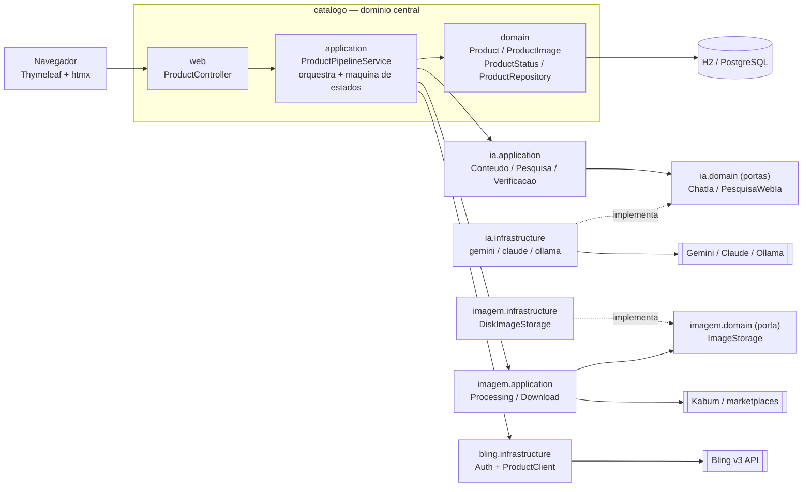
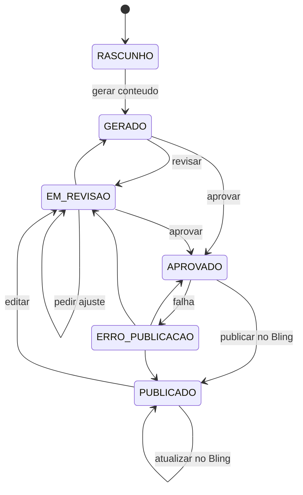
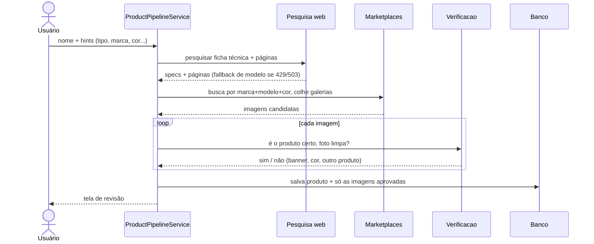

# catalog-bling-ia-integration

Pipeline de cadastro de produtos para e-commerce: pesquisa com IA + Bling.

Dashboard web em Spring Boot que, a partir do **nome de um produto** (ou de um
link), pesquisa a ficha técnica e as imagens na web, gera título e descrições
seguindo templates + SEO, trata as imagens e publica no Bling v3 — com um ciclo
de **revisão humana** no meio: você edita o texto e/ou pede ajustes à IA antes
de publicar.

O provedor de IA é **configurável** (Gemini, Claude ou Ollama). O padrão é o
**Gemini** (free tier), então dá para rodar sem custo.

### Destaques

- **Pesquisa por nome ou link**, com campos opcionais (tipo, marca, modelo,
  EAN/GTIN, SKU, fornecedor, fabricante) que orientam a busca a priorizar o site
  do fabricante e do fornecedor.
- **Imagens múltiplas** colhidas de marketplaces (Kabum), do link que você colar
  e das páginas citadas — com ampla cobertura de CDNs/DAMs (Scene7, Cloudinary,
  VTEX etc.), priorizando a **cor** informada, tratadas em 1024×1024 (≤200 KB).
- **Verificação por visão**: cada imagem é classificada pela IA — foto limpa
  (com margem), ambientada (cena real, sem margem) ou rejeitada (produto/cor
  errados, banner ou arte com texto).
- **Bling**: cria o produto, ou **atualiza** (PUT) se ele já existir (por
  GTIN/nome/id); também **lista e importa** produtos já cadastrados no Bling
  para revisar e atualizar.
- **Fallback de modelos Gemini** por cota: quando um modelo bate no limite
  diário, cai automaticamente para o próximo.

## Arquitetura

Organização por **contextos DDD** (catalogo, ia, bling, imagem), cada um em
camadas `domain` / `application` / `infrastructure` / `web`. Os subdomínios de
IA e imagem seguem **portas & adaptadores** (hexagonal): a lógica depende de
uma *porta* (interface no `domain`) e os provedores concretos ficam na
`infrastructure`, plugáveis por configuração.



- **catalogo** é o núcleo: o `ProductPipelineService` (application) é o único que
  conhece o fluxo inteiro e a máquina de estados; o `Product` (aggregate) e o
  `ProductRepository` (porta) vivem no `domain`.
- **ia** e **imagem** expõem portas (`ChatIa`, `PesquisaWebIa`, `ImageStorage`)
  implementadas por adaptadores trocáveis. Isso permite trocar Gemini↔Claude↔
  Ollama, ou disco↔bucket, sem tocar na lógica.
- **bling** é a camada anticorrupção do ERP (OAuth + client REST).

### Ciclo de vida do produto (máquina de estados)

Só produtos **aprovados** chegam ao Bling (o portão de revisão humana). As
transições válidas são impostas no enum `ProductStatus`.



## Como rodar

Pré-requisitos: **JDK 21** e **Maven**.

1. Configure os segredos. Duas formas (o arquivo local sobrescreve o
   `application.yml`):

   - **Arquivo local (recomendado em dev)** — crie um `application-local.yml` na
     raiz do projeto (já está no `.gitignore`, não é commitado):

     ```yaml
     gemini:
       api-key: sua-chave-do-gemini
     bling:
       client-id: seu-client-id
       client-secret: seu-client-secret
     ```

   - **Variáveis de ambiente:**

     ```bash
     export GEMINI_API_KEY=...          # provider padrão (free tier)
     export BLING_CLIENT_ID=seu-client-id
     export BLING_CLIENT_SECRET=seu-client-secret
     # URL pública do app — o Bling BAIXA a imagem por ela.
     # Em dev, suba um túnel (ex.: ngrok http 8080) e use a URL https:
     export APP_PUBLIC_BASE_URL=https://seu-tunel.ngrok-free.app
     ```

   Crie uma chave grátis do Gemini em https://aistudio.google.com.

2. Suba a aplicação:

   ```bash
   mvn spring-boot:run
   ```

3. Acesse http://localhost:8080

O banco padrão é **H2 em arquivo** (pasta `./dados`), então roda sem instalar
nada. Para produção, troque o bloco `spring.datasource` do `application.yml`
por PostgreSQL:

```yaml
spring:
  datasource:
    url: jdbc:postgresql://localhost:5432/catalogo
    username: postgres
    password: postgres
```

## Fluxo no dashboard

1. **+ Novo produto** — duas opções:
   - **Só o nome (pesquisa automática)**: digite o nome ou cole um link do
     produto (ex.: `mouse logitech pebble 2 m350s rose`). Campos opcionais
     (tipo, marca, modelo, EAN/GTIN, SKU, fornecedor, fabricante) ajudam a IA a
     achar o produto certo e a priorizar o fabricante/fornecedor. A IA levanta a
     ficha técnica e o sistema baixa e trata **várias imagens**. Pode levar
     alguns minutos.
   - **Manual**: cole os dados brutos do fornecedor, marca, modelo, categoria,
     EAN, SKU e (opcional) as imagens (pode subir várias).
2. Na tela do produto, o bloco **Imagem** mostra a galeria; dá para **adicionar
   mais** imagens (upload múltiplo) e **remover** as que não quiser.
3. **Gerar** cria título, descrição curta e complementar seguindo os templates
   e o SEO, e avalia a imagem principal.
4. **Revise**: edite os campos direto (incluindo o **título do produto**), ou
   peça ajustes no chat ("deixe o título mais curto", "destaque o Silent
   Touch"). A IA mantém o contexto da conversa.
5. **Aprovar** libera a publicação. **Conectar Bling** (topo) faz o OAuth uma vez.
6. **Publicar no Bling** — se o produto já existir lá (id salvo, ou encontrado
   por GTIN/nome), atualiza via PUT; senão cria via POST. Produtos publicados
   têm o botão **Atualizar no Bling** para reenviar edições.
7. **Produtos do Bling** (topo) — lista os produtos já cadastrados no Bling e
   permite **importar** um para a revisão, ajustar conteúdo/imagens e atualizá-lo.

### Pesquisa automática, passo a passo



## Imagens

- **Fontes**: busca direta na **Kabum** por marca+modelo(+cor); se você colar um
  **link**, a página dele é aberta e a galeria colhida; e as páginas que a
  pesquisa web citar. A extração é ampla — og:image, JSON-LD e os principais
  CDNs/DAMs de e-commerce e fabricantes: **Scene7** (Samsung), **Cloudinary**
  (Logitech), **VTEX**, **Contentful**, **imgix**, além de Kabum, Mercado Livre,
  Amazon e Magalu — sempre na maior resolução disponível.
- **Cor**: se você informar a cor (no nome), ela é traduzida (rose→rosa,
  black→preto, ...) e priorizada — a busca e a extração pulam as outras cores e a
  verificação passa a exigir a cor. Sem cor informada, aceita qualquer cor do
  produto correto.
- **Verificação por visão**: cada imagem é enviada à IA (numa cadeia de modelos
  dedicada — veja abaixo) e classificada em:
  - **limpa** — produto sozinho, fundo neutro → entra **com** a margem de respiro;
  - **ambientada** — produto numa cena real, sem texto → entra **sem** margem
    (enquadramento cheio);
  - **rejeitar** — outro produto, cor errada, banner/arte com texto, logo ou
    colagem → descartada.
- **Tratamento**: 1024×1024 em canvas branco (margem de 180px só nas "limpas"),
  compressão binária de qualidade JPEG até ≤200 KB. PNG transparente (ex.: fotos
  oficiais de fabricante) fica com fundo branco.
- **Uploads manuais não passam pela verificação** (a foto é sua escolha).
- **Fallback headless (opcional, desligado por padrão)**: quando a extração
  estática de uma página traz poucas imagens (< 2), o sistema pode renderizar a
  página num navegador headless (Playwright) e repetir a extração sobre o HTML já
  com o JavaScript executado. Isso resolve galerias dinâmicas onde as fotos só
  aparecem após o JS (ex.: Samsung, que passa de 1 → ~11 imagens). **Não** vence
  bloqueios anti-bot fortes (Akamai/Cloudflare em LG, Amazon, Mercado Livre e
  Pichau detectam e barram o headless). Para ligar:
  ```bash
  # 1) baixe o Chromium uma vez
  mvn -q dependency:build-classpath -Dmdep.outputFile=cp.txt
  java -cp "$(cat cp.txt)" com.microsoft.playwright.CLI install chromium
  # 2) rode com o fallback ativo
  IMAGEM_HEADLESS_ENABLED=true mvn spring-boot:run
  ```
- **Limitações**: sites com bloqueio anti-bot (ex.: Cloudflare/Akamai) não são
  raspáveis nem com o headless — nesses casos, use um link de outra fonte ou o
  upload manual.

## Provedores de IA (Gemini, Claude, Ollama)

O provedor é escolhido no `application.yml` (ou por env), separadamente para a
geração de conteúdo e para a pesquisa web:

```yaml
ia:
  provider: gemini           # gemini | claude | ollama   (geração de conteúdo + visão)
  pesquisa-provider: gemini  # gemini | claude            (pesquisa web)
```

| Provedor | Custo | Geração + visão | Pesquisa web | Configuração |
|---|---|---|---|---|
| **gemini** (default) | **free tier** | ✅ | ✅ Google Search grounding | `GEMINI_API_KEY` (grátis em https://aistudio.google.com), `GEMINI_MODEL` |
| **claude** | pago (centavos/cadastro) | ✅ melhor escrita pt-BR | ✅ web search | `ANTHROPIC_API_KEY`, `ANTHROPIC_MODEL` |
| **ollama** | **grátis, 100% local** | ✅ (modelo multimodal) | ❌ não tem — use gemini ou claude na pesquisa | `ollama pull gemma3`; `OLLAMA_BASE_URL`, `OLLAMA_MODEL` |

### Fallback e cota (Gemini)

O free tier do Gemini limita **requisições por dia (RPD)** por modelo — a maioria
dos flash é ~20/dia, mas o `gemini-3.1-flash-lite` é ~500/dia. Como a
**verificação de imagem** é o que mais gasta requisições (uma por foto), ela roda
numa **cadeia de modelos separada**, deixando os modelos "bons" (baixo volume,
alta qualidade) para a pesquisa e a geração de texto:

```yaml
gemini:
  model: gemini-3.5-flash
  # pesquisa + geração de texto: tenta em ordem quando um modelo dá 429/503/500/404
  fallback-models: gemini-3.1-flash-lite,gemini-2.5-flash-lite,gemini-flash-lite-latest,gemini-3-flash-preview,gemini-2.5-flash
  # verificação de imagem (alto volume): usa o modelo de maior cota diária primeiro
  verificacao-models: gemini-3.1-flash-lite,gemini-2.5-flash-lite,gemini-flash-lite-latest
```

Atenção: no free tier do Gemini o Google pode usar os dados enviados para
treinamento — irrelevante para ficha técnica de produto, mas fique ciente.

## Onde ajustar os padrões

- Templates de descrição, padrão de título, regras de categoria, o prompt da
  pesquisa web e o prompt de verificação de imagem:
  `ia/application/ProductPrompts.java` — é o lugar único do padrão de saída
  (vale para todos os provedores).
- Tratamento da imagem (1024², margem de 180px, ≤200 KB):
  `imagem/application/ImageProcessingService.java`.
- Busca/colheita de imagens (Kabum, galeria, lado mínimo):
  `imagem/application/ImageDownloadService.java`.
- Verificação por visão: `ia/application/VerificacaoImagemIaService.java`.
- Quantidades (imagens mantidas/candidatas, páginas de marketplace):
  constantes em `catalogo/application/ProductPipelineService.java`.

## Pontos a confirmar antes de produção

- **Campos do POST /produtos do Bling**: confira os nomes exatos
  (`descricaoCurta`, `descricaoComplementar`, `gtin`, `midia.imagens.externas`)
  na referência oficial: https://developer.bling.com.br/referencia
- **URL pública da imagem**: o Bling precisa alcançar `APP_PUBLIC_BASE_URL` pela
  internet no momento da publicação. Em produção, use um domínio real ou um
  bucket público (S3/R2/MinIO) — implemente a porta `imagem/domain/ImageStorage`
  no lugar de `imagem/infrastructure/DiskImageStorage`.
- **Segredos**: nunca commite chaves. Use o `application-local.yml` (git-ignorado)
  ou variáveis de ambiente.

## Estrutura de pacotes

```
com.loja.catalogbling
├── catalogo/          domínio central (aggregate Product)
│   ├── domain/        Product, ProductImage, ProductStatus, ConversationTurn, ProductRepository
│   ├── application/   ProductPipelineService (orquestrador + máquina de estados)
│   └── web/           ProductController, HomeController
├── ia/                subdomínio de conteúdo/pesquisa
│   ├── domain/        portas ChatIa, PesquisaWebIa + value objects
│   ├── application/   *IaService (conteúdo, pesquisa, verificação), ProductPrompts, RespostaJson
│   └── infrastructure/ adapters claude/ gemini/ ollama/ + IaHttp
├── bling/             integração ERP (anticorrupção)
│   ├── domain/        BlingToken, BlingTokenRepository
│   ├── infrastructure/ BlingAuthService (OAuth + refresh), BlingProductClient
│   └── web/           BlingOAuthController
├── imagem/            subdomínio de imagem
│   ├── domain/        ImageStorage (porta)
│   ├── application/   ImageProcessingService, ImageDownloadService
│   └── infrastructure/ DiskImageStorage
└── config/            @ConfigurationProperties (anthropic, gemini, ollama, bling, app)
```
